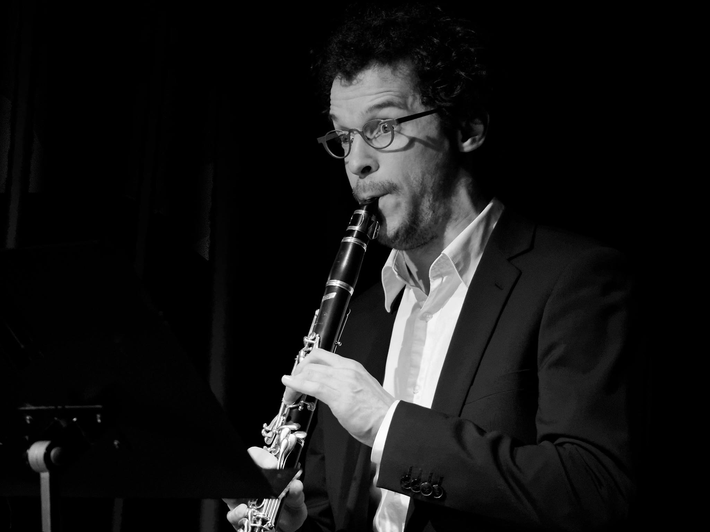

Format: 

## Rik De Geyter

The Belgian clarinetist Rik De Geyter is currently clarinettist/bass clarinettist of the Trondheim Symphony Orchestra in Norway, ass.prof. clarinet and bassclarinet at NTNU Institutt for Musikk in Trondheim and since 2011 is he assistant-teacher of Eddy Vanoosthuyse, first at the Lemmensinstitute in Leuven and now at the Royal Conservatory in Liège (Belgium).
He is a former clarinettist of the Royal Band of the Belgian Guides, was a member of the EUYO (European Union Youth Orchestra) and played with the Brussels Philharmonic, Trondheim Sinfonietta, Trondheim Soloists, Württembergisches Kammerorchester Heilbronn, Alpaca Ensemble amongst others. He ́s the clarinetist of Thelema Trio (21th century music) and Trio De Geyter-Callot. At the Lemmensinstitute in Leuven (Belgium), he studied with Eddy Vanoosthuyse and graduated as Master in Music in 2009 and Master-after-Master in 2013. In between he went to the Ghent conservatory where he studied bass clarinet with Marc Kerckhof.

### Contact
rikdegeyter@hotmail.com
